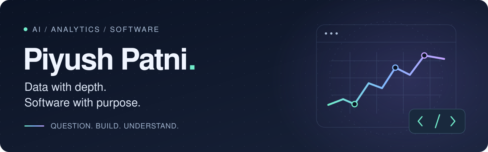

  

  <strong>I turn data into explanations, models into experiments, and ideas into working software.</strong>

  B.Tech · Cyber Physical Systems · Manipal Institute of Technology 
  Minor in Data Science

  <a href="https://www.linkedin.com/in/piyush-patni-1bb52827b/">LinkedIn ↗</a> &nbsp; / &nbsp;
  <a href="mailto:piyupatni@gmail.com">Say hello ↗</a> &nbsp; / &nbsp;
  <a href="#selected-work">Explore my work ↓</a>

---

### A little about how I build

I'm **Piyush**, working across **data analytics, applied AI/ML, and full-stack development**. I enjoy the whole path from a messy dataset or an interesting question to something someone can actually use.

Three questions guide my work: **What problem does this solve? What does the evidence support? Can someone else reproduce it?**

| Investigate | Build | Explain |
| :--- | :--- | :--- |
| Find useful patterns with Python, SQL, statistics, and feature engineering. | Connect models, APIs, and interfaces into complete applications. | Make results understandable through clear dashboards, baselines, and documented trade-offs. |

## Selected work

### 01 / TrendPulse

**What is gaining attention—and is it likely to last?**

An internet trend intelligence platform that goes beyond popularity rankings: discover emerging topics, unpack momentum, investigate spikes, compare platform timing, and benchmark short-term forecasts.

**Inside the project**

- **Explainable analytics:** seven momentum factors, lifecycle stages, anomaly evidence, and sustainability assessment.
- **Honest evaluation:** chronological validation, naive forecasting baselines, uncertainty intervals, and explicit non-causal lead/lag analysis.
- **Reproducible by design:** 18 fictional topics, 16,128 multi-source observations, SQL analytical views, and 60 passing tests at the latest audit.

`Python` `Pandas` `NumPy` `DuckDB / SQL` `scikit-learn` `Plotly` `Streamlit`

[Explore TrendPulse ↗](https://github.com/turbzox1/TrendPulse) · [Read the methodology ↗](https://github.com/turbzox1/TrendPulse/blob/main/docs/analytics-audit.md)

Demo observations are synthetic, not live Reddit or Google data. Scores are interpretable heuristics, not calibrated probabilities.

### More things I've built

<table>
  <tr>
    <td width="50%" valign="top">
      <h3>02 / Personal Finance Intelligence</h3>
      
<strong>Applied AI meets a full-stack product.</strong>

      
An AI-powered financial intelligence platform built around a Next.js frontend and a FastAPI backend.

      
<code>Next.js</code> <code>FastAPI</code> <code>Python</code>

      
<a href="https://github.com/turbzox1/Personal-Finance-Intelligence">Explore the project ↗</a>

    </td>
    <td width="50%" valign="top">
      <h3>03 / REVIVE</h3>
      
<strong>Recovery strategies, evaluated with guardrails.</strong>

      
An autonomous payment-recovery system with strategy evaluation, simulation, and merchant guardrails.

      
<code>Python</code> <code>ML</code> <code>Docker</code> <code>Simulation</code>

      
<a href="https://github.com/turbzox1/REVIVE">Explore the project ↗</a>

    </td>
  </tr>
</table>

#### 04 / Insurance Support Chatbot

**Retrieval-backed conversations for insurance support.** A LangGraph + RAG assistant combining retrieval, context compression, query rewriting, and web search.

`Python` `LangGraph` `RAG` `Retrieval`

[Explore the project ↗](https://github.com/turbzox1/insurance-support-chatbot)

## My toolkit

| Area | Tools I work with |
| :--- | :--- |
| **Languages** | Python · SQL · C++ · Java · R |
| **Analytics & visualization** | Pandas · NumPy · DuckDB · Plotly · Matplotlib · Streamlit · Power BI |
| **Machine learning** | scikit-learn · XGBoost · feature engineering · SMOTE |
| **Generative AI & retrieval** | LangChain · LangGraph · ChromaDB · RAG |
| **Applications & APIs** | Next.js · FastAPI · SQLAlchemy · Redis · SQLite |
| **Development** | Git · GitHub · Docker · reproducible experiments · automated tests |

## Learning, deliberately

My **Cyber Physical Systems** background and **Data Science** minor connect systems thinking with analytical problem-solving. I like projects that make me practice both.

  
<strong>Certifications &amp; coursework</strong>

- Google AI Professional Certificate
- Johns Hopkins Data Science Specialization
- Python for Data Analysis
- Introduction to Data Analysis using Microsoft Excel

---

  <strong>Have an interesting problem, project, or opportunity?</strong> 
  I'm open to conversations about analytics, AI/ML, and software engineering.  
  <a href="https://www.linkedin.com/in/piyush-patni-1bb52827b/">Let's connect on LinkedIn ↗</a>
  &nbsp; · &nbsp;
  <a href="mailto:piyupatni@gmail.com">Send me an email ↗</a>

Curiosity in. Useful things out.

